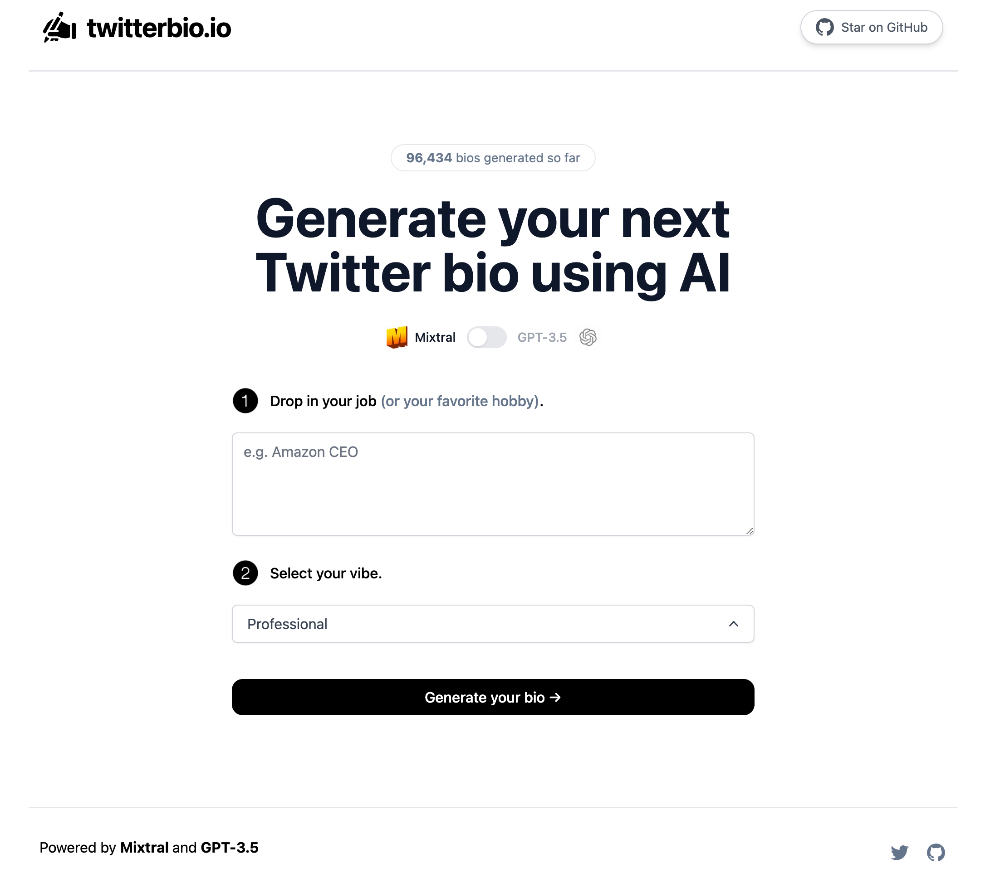

# [twitterbio.io](https://www.twitterbio.io/)

This project generates Twitter (X) bios for you using AI.

[](https://www.twitterbio.io)

## How it works

This project uses both [Mixtral]() and [GPT-3.5](https://openai.com/api/) with streaming through a [Vercel Edge functions](https://vercel.com/features/edge-functions). It constructs a prompt based on the form and user input, sends it either to the Mixtral API through Together.ai or the GPT-3.5 API through OpenAI, then streams the response back to the application.

If you'd like to see how I built a previous version of this, check out the [video](https://youtu.be/JcE-1xzQTE0) or [blog post](https://vercel.com/blog/gpt-3-app-next-js-vercel-edge-functions).

## Running Locally

After cloning the repo, go to [OpenAI](https://beta.openai.com/account/api-keys) to make an account and put your API key in a file called `.env`. Then create an account at Together.ai and add that API key in as well to run the Mixtral model. See the `.example.env` for the environment variables needed.

Then, run the application in the command line and it will be available at `http://localhost:3000`.

```bash
npm run dev
```

## One-Click Deploy

Deploy the example using [Vercel](https://vercel.com?utm_source=github&utm_medium=readme&utm_campaign=vercel-examples):

[](https://vercel.com/new/clone?repository-url=https://github.com/Nutlope/twitterbio&env=OPENAI_API_KEY,TOGETHER_API_KEY&project-name=twitter-bio-generator&repo-name=twitterbio)

## Future tasks

- [ ] Add more AI models via a dropdown
